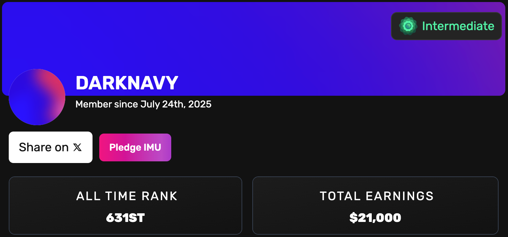
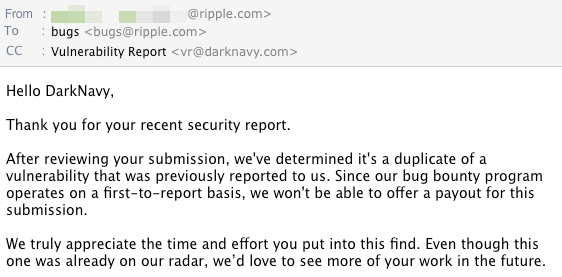

# web3-skills

Web3 security skills kit — smart contract auditing, blockchain client auditing, and on-chain exploit investigation.

## Skills

| Skill | Description |
|-------|-------------|
| [**contract-auditor**](./contract-auditor/) | Security audit for smart contracts |
| [**client-auditor**](./client-auditor/) | Security audit for blockchain client codebases (Go, Rust, C/C++, etc.) |
| [**exploit-investigator**](./exploit-investigator/) | On-chain attack transaction investigation and incident reporting |

See each skill's README for usage details.

## Install

Tell your Coding agent:

```
Install skill https://github.com/DarkNavySecurity/web3-skills/
```

Or clone manually:

```bash
git clone https://github.com/DarkNavySecurity/web3-skills.git
bash web3-skills/install.sh
```

## Update

```
Update skill https://github.com/DarkNavySecurity/web3-skills/
```

## Track Record

**Smart Contract Auditing** — $21K earned on [Immunefi](https://immunefi.com/)



**Blockchain Client Auditing** — Independently discovered a vulnerability in [rippled](https://github.com/XRPLF/rippled) (XRP Ledger), officially acknowledged and patched



**Onchain Exploit Analysis** — Artifacts in [web3-exploit-analysis](https://github.com/DarkNavySecurity/web3-exploit-analysis), also posted on [](https://x.com/Defi_Nerd_sec)


## License

[MIT](./LICENSE)

## Contact

[](https://x.com/DarkNavyOrg) [](https://x.com/Defi_Nerd_sec) [](https://www.darknavy.org/)