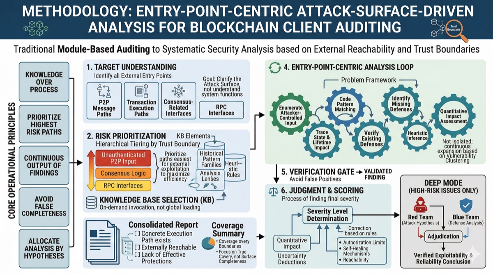

# Blockchain Client Auditor



A Claude Code skill for security auditing of blockchain node implementations. Covers execution clients, consensus clients, app-chain SDKs, bridges, and any codebase with P2P networking or consensus logic — written in Go, Rust, C/C++, etc.

---

## What it does

The skill runs a **structured 7-stage audit** using an orchestrator + subagent architecture. The main context acts as coordinator and never reads source code or pattern files directly — all deep analysis is delegated to specialized subagents that write findings to disk as they confirm them.

**Stages:**
1. **Setup** — creates output directories, records audit parameters
2. **Recon** — maps codebase structure, entry points, trust boundaries, and applicable patterns
3. **Hunt** — parallel subagents analyze assigned subsystems against 20 vulnerability pattern families
4. **Cross-subsystem** — traces trust boundary mismatches at subsystem call sites
5. **Validation** — deduplicates findings, applies severity override rules
6. **Adversarial review** *(deep mode)* — Red Team / Blue Team / Judge protocol for HIGH+ findings
7. **Report** — consolidated report from disk state

**Knowledge base:**
- **20 vulnerability pattern families** covering input validation, consensus correctness, resource exhaustion, memory safety, concurrency, serialization, and more
- **7 structured analysis lenses** for systematically examining code at trust boundaries
- **Heuristic strategies** for finding bugs that patterns alone won't catch
- **A judgment framework** with false-positive gates, confidence scoring, and severity classification

---

## Design philosophy

- **Orchestrator + worker.** The main context stays lean — it coordinates and validates but never reads source code or pattern files. Subagents do all the deep work. This allows the audit to complete on large codebases (70K+ lines) without context compaction.
- **Handbook, not pipeline.** Hunt agents receive the full vulnerability handbook and explore freely — patterns, checklists, and heuristics are references to consult, not a sequence to execute. The agent decides what to read, where to dig, and when to stop.
- **Findings flow continuously.** Confirmed findings are written to disk as they're verified, not held until the end. The audit is resumable if interrupted.
- **Honest coverage over false completeness.** "3 confirmed findings in P2P handlers; consensus subsystem not analyzed" beats "comprehensive audit, 100% coverage" that isn't true.
- **Highest risk first.** Spend time proportional to risk (per the trust boundary model), not proportional to code volume.

---

## Install

Follow the [Claude Code skills installation guide](https://docs.anthropic.com/en/docs/claude-code/skills).

```
Install skill https://github.com/DarkNavySecurity/skills/client-auditor
```

---

## Usage

```
/client-auditor [target-path] [deep]
```

| Argument | Meaning |
|----------|---------|
| `target-path` | Path to audit. Use `.` for the current directory. Required. |
| `deep` | Enables adversarial review (Red Team / Blue Team / Judge) for high-severity findings. |

**Examples:**

```bash
# Audit the current repo
/client-auditor .

# Audit a specific subdirectory
/client-auditor ./node

# Full deep audit with adversarial review
/client-auditor . deep
```

---

## Knowledge base

### Vulnerability patterns (20 families)

| ID | Name | Applicability |
|----|------|---------------|
| P1 | Negative / illegal input triggers unrecoverable panic | All clients |
| P2 | Error handling defect in batch processing loops | All clients |
| P3 | EVM compatibility layer impedance mismatch | EVM clients only |
| P4 | Validator set / staking hook state inconsistency | All clients |
| P5 | Vote / signature deduplication failures | All clients |
| P6 | Non-determinism in consensus-path execution | All clients |
| P7 | RPC handler crash via malformed request | All clients |
| P8 | Fee grant and fee deduction errors | Complex fee systems only |
| P9 | P2P resource exhaustion (DoS without rate limit) | All clients |
| P10 | Bridge / cross-layer message integrity | Bridge clients only |
| P11 | Unbounded compute in consensus paths | All clients |
| P12 | ZK circuit under-constraint | ZK clients only |
| P13 | Charge ordering and gas accounting errors | All clients |
| P14 | Replay and double-spend | All clients |
| P15 | Precision loss and rounding manipulation | All clients |
| P16 | Wiring failures (handler registered to wrong route) | All clients |
| P17 | Memory safety (C/C++ and unsafe Rust) | C/C++, unsafe Rust only |
| P18 | Concurrency and data races | Multi-threaded only |
| P19 | Undefined / implementation-defined behavior | C/C++ only |
| P20 | Serialization boundary hardening | All clients |

### Analysis techniques

- **Analysis checklist** — 7 lenses: branch exhaustion, zero-trust message check, data lifetime trace, quantitative resource accounting, missing-defense inventory, thread safety, memory safety
- **Heuristic strategies** — structural suspicion, complexity signals, temporal assumptions, cross-boundary data flow, cross-subsystem interactions, implicit global state
- **Adversarial review** — Red Team / Blue Team / Judge protocol for stress-testing high-severity findings

### Judgment framework

- **3-check false-positive gate** — concrete execution path, external reachability, no sufficient existing guard
- **Confidence scoring** — start at 100, apply deductions for admin requirements, key compromise prerequisites, quorum thresholds, non-default config, partial mitigations, etc.
- **Severity classification** — Critical (chain-wide, ≥80), High (≥70), Medium (40-69), Low (20-39), Info (<20)
- **Override rules** — caps for admin-only, trusted-party key, quorum-required, self-recovering, and unreachable-path findings

---

## Output

All output is written to `audit/` in the working directory:

```
audit/
  metadata.md          — audit parameters (target, date, mode)
  manifest.md          — recon output: subsystem map, entry points, applicable patterns
  findings/[ID].md     — one file per confirmed finding, written as confirmed
  progress/[name].md   — subsystem checkpoints (for resume after interruption)
  report.md            — final consolidated report
```

Run `ls audit/findings/` at any time during the audit to see confirmed findings as they land.

Each finding includes:

```
Severity    — Critical / High / Medium / Low / Informational
Confidence  — 0–100 score after applying deduction table
Pattern     — P1–P20 family that matched (or "heuristic finding")
Location    — file:line_start–line_end
Entry point — how an attacker reaches this code
Description — what the code does, what it fails to do, attacker outcome
Trigger     — step-by-step attack scenario
Quantitative impact — cost × rate × messages = total; time to impact
Existing mitigations — every partial defense, with effectiveness
Missing defenses     — what should be here but isn't
Recommendation       — concrete fix with code location reference
Adversarial review   — [deep only] Red/Blue/Judge verdict table
```

The report opens with an executive summary, includes findings by severity, and closes with an honest coverage summary describing what was and wasn't analyzed.

---

## Scope

**Works well on:**
- Execution clients (e.g., go-ethereum, Erigon, Reth, Nethermind, Besu)
- Consensus clients (e.g., Lighthouse, Prysm, Teku, Nimbus, Lodestar)
- App-chain SDKs (e.g., Cosmos SDK, Substrate, Tendermint/CometBFT)
- Custom chains and L2 node implementations
- Bridge and relayer codebases
- Any codebase with P2P networking, RPC servers, or consensus logic

**Notes:**
- For very large codebases, specify a subdirectory to focus the audit
- Deep mode is slower; budget extra time for adversarial review
- Cryptographic implementation correctness requires specialist review beyond pattern matching
