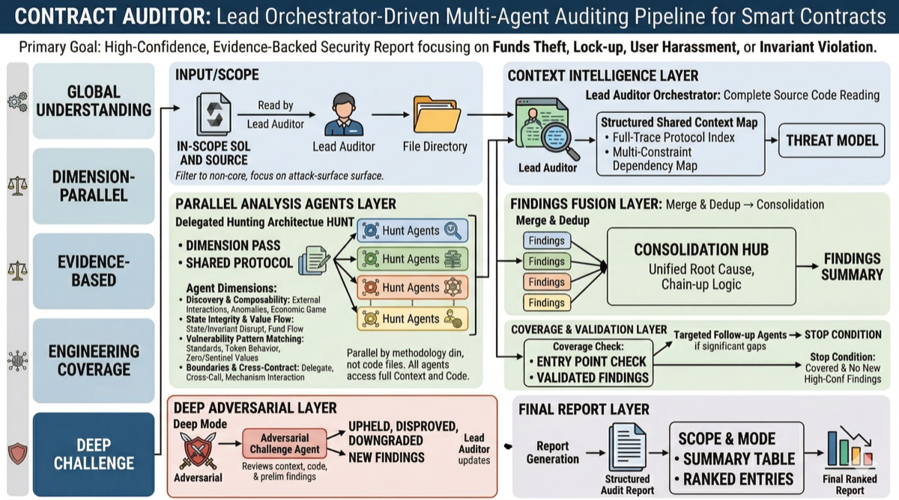

# contract-auditor



A methodology-driven AI security auditor for Solidity. The lead auditor reads code, builds a structured context map, then delegates focused analysis to hunt agents — each with a different analytical dimension. Findings are merged, deduplicated, and validated.

Built for:

- **Solidity devs** who want a security check before every commit
- **Security researchers** looking for fast wins before a manual review
- **Just about anyone** who wants an extra pair of eyes

Not a substitute for a formal audit — but the check you should never skip.

## Design philosophy

The lead auditor reads every line of code first. No agent hunts blind.

**Context map** — Before any hunting begins, the orchestrator reads all source files and builds a structured context map: entry points with file:line pointers, state architecture (who writes / who reads), value flows, cross-contract dependencies, and observations. This becomes the shared substrate for the entire audit — agents navigate from it, coverage tracks against it.

**Dynamic agent strategy** — Hunt agents scale to observed complexity. Each gets a distinct analytical dimension as a lens, not a boundary:

| Dimension | Focus |
|-----------|-------|
| Discovery & Composability | External interactions, anomaly detection, economic game theory |
| State Integrity & Value Flow | Invariant breaking, state propagation, value flow tracing |
| Vulnerability Pattern Matching | Standard vulnerability classes, token behavior, zero/sentinel analysis |
| Boundaries & Cross-Contract | Delegation boundaries, cross-contract interactions, mechanism matrices |

Agents explore freely — the context map orients them, references load on-demand when needed.

**Validation discipline** — Every finding passes through a structured protocol (3-gate + 6D adversarial scoring). DEEP mode adds an adversarial agent that challenges every finding with a 6-check falsification protocol and hunts independently for what the other agents missed.

## Usage

```bash
# Scan the full repo
/contract-auditor

# Deep: context building + adversarial challenge
/contract-auditor deep

# Review specific file(s)
/contract-auditor src/Vault.sol
/contract-auditor src/Vault.sol src/Router.sol

# Write report to a markdown file (terminal-only by default)
/contract-auditor --file-output
```

> Knowledge base informed by community research including [smart-contract-auditing-heuristics](https://github.com/OpenCoreCH/smart-contract-auditing-heuristics) and [smart-contract-vulnerabilities](https://github.com/kadenzipfel/smart-contract-vulnerabilities).